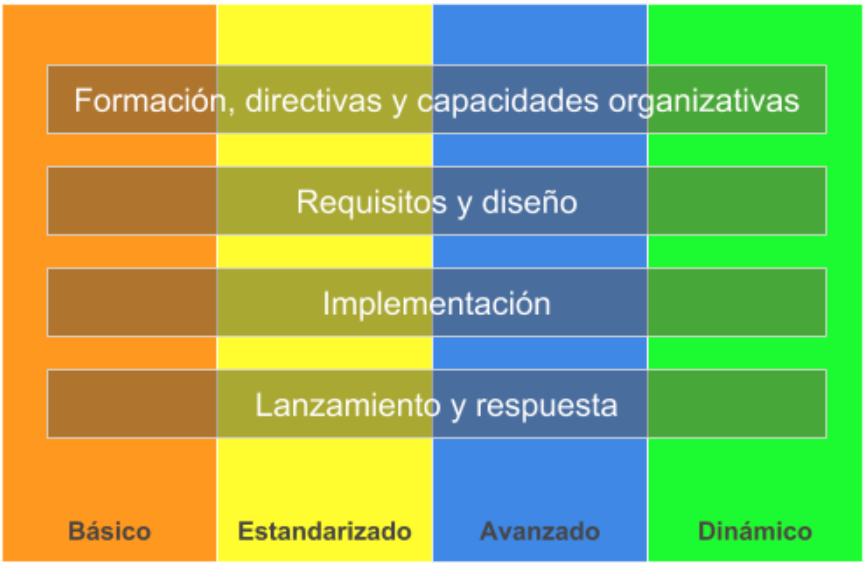
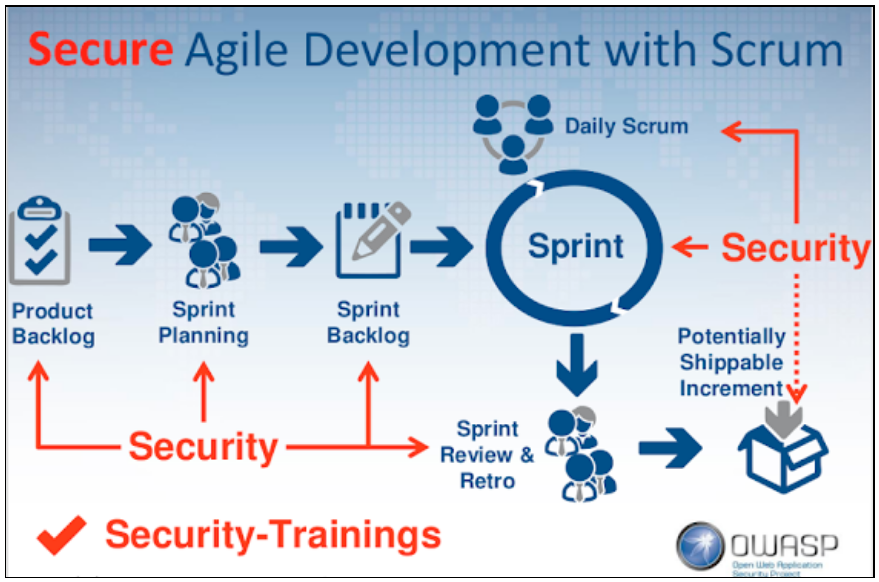

# Security Development Lifecycle

El presente documento tiene como objetivo ilustrar los conceptos básicos del ciclo de vida de desarrollo seguro (Secure SDLC, Software Development Lifecycle) y abordar cada una de las actividades de seguridad que deben llevarse a cabo para lograr la conformidad con el proceso.

Aquí se abordan únicamente las metodologías de seguridad para el desarrollo de aplicaciones de software y de servicios en línea tanto para uso externo como interno. En ningún caso están orientadas a los riesgos de seguridad “operativos”.

El proceso de Secure SDLC se basa en tres conceptos básicos: **formación, mejora continua de los procesos y responsabilidad**. La formación continua de los integrantes del equipo de desarrollo de software es fundamental. Si se invierte de manera apropiada en la transferencia de los conocimientos, las organizaciones podrán responder adecuadamente a los cambios que sufren las tecnologías y las amenazas. Dado que los riesgos para la seguridad no son estáticos, Secure SDLC destaca especialmente la importancia de comprender la causa y el efecto de las vulnerabilidades de seguridad y requiere una evaluación periódica de los procesos de Secure SDLC y la introducción de cambios como respuesta a los avances tecnológicos o las nuevas amenazas. Se recopilan datos para evaluar la eficacia de la formación, se usan métricas de procesos para documentar su conformidad y métricas posteriores al lanzamiento ayudan a definir los futuros cambios. Por último, Secure SDLC requiere el archivado de todos los datos necesarios para realizar el mantenimiento de una aplicación en caso de que surjan problemas. Si lo combinan con detallados planes de comunicación y de respuesta en materia de seguridad, las organizaciones podrán orientar de manera concisa y contundente a todas las partes implicadas.

## Modelo de optimización del proceso Secure SDLC.

La integración de los conceptos de desarrollo seguro en un proceso de desarrollo existente puede resultar intimidante y costosa si no se procede de manera adecuada. Muchas veces, el éxito o el fracaso depende de variables como el tamaño de la organización, los recursos (tiempo, talento y presupuestos) y el respaldo de los directivos. Para poder controlar el impacto de estos intangibles, hace falta comprender los elementos que componen procedimientos de desarrollo de seguridad eficaces y establecer prioridades de implementación según el nivel de madurez del equipo de desarrollo. El presente documento se basa en un modelo de optimización de Secure SDLC como ayuda para abordar estas cuestiones.

El modelo de optimización de Secure SDLC está estructurado en torno a cinco áreas de capacidades que, en líneas generales, se corresponden con las fases del ciclo de vida de desarrollo de software:

- Formación, directivas y capacidades organizativas
- Requisitos y diseño
- Implementación
- Comprobación
- Lanzamiento y respuesta

Además, el modelo de optimización de Secure SDLC define cuatro niveles de madurez para los procedimientos y capacidades de estas áreas: **básico, estandarizado, avanzado y dinámico.**

El modelo de optimización de Secure SDLC comienza en el nivel de madurez básico, con pocos o sin procesos, cursos de formación y herramientas, y evoluciona hacia el nivel dinámico, que se caracteriza por la total conformidad con Secure SDLC. La total conformidad con Secure SDLC incluye procesos eficaces, personas altamente cualificadas, herramientas especializadas y un alto grado de responsabilidad por parte de las personas tanto internas como externas a la organización.

A diferencia de otros modelos de madurez de software, el modelo de optimización de Secure SDLC se centra estrictamente en las mejoras de los procesos de desarrollo. Proporciona instrucciones prácticas sobre cómo pasar de un nivel de madurez de procesos más bajo a un nivel de madurez más alto y evita el enfoque “lista de listas” de los otros modelos de optimización.

## Actividades de seguridad

En términos sencillos, el proceso Secure SDLC es un conjunto de actividades de seguridad obligatorias, que se presentan en el orden en que deben llevarse a cabo y se agrupan por cada una de las fases de un ciclo de vida de desarrollo de software tradicional. Muchas de las actividades descritas aportarían ciertos beneficios en materia de seguridad si se implementaran de manera independiente. Sin embargo, las actividades de seguridad realizadas como parte de un proceso de desarrollo de software aportan mayores beneficios que las actividades implementadas de manera poco sistemática o de modo ad hoc.

Es posible agregar actividades de seguridad opcionales a discreción del equipo de proyecto o del asesor de seguridad a fin de alcanzar los objetivos deseados en el ámbito de la seguridad y la privacidad. Para mayor brevedad, no se incluyen descripciones detalladas de las actividades de seguridad.

Como concepto fundamental, cabe observar que una organización debe enfocarse en la calidad y la integridad de los resultados obtenidos en cada fase. De las organizaciones situadas en los niveles Avanzado y Dinámico del modelo de optimización de Secure SDLC, se espera que los procesos de seguridad tengan cierto grado de sofisticación. Dicho eso, da igual que un modelo de riesgos sea generado, por ejemplo, como resultado de una sesión de pizarra con el equipo de desarrollo, se redacte como un relato en un documento de Microsoft Word o se elabore con ayuda de una herramienta especializada, como la herramienta de creación de modelos de riesgos de Secure SDLC. Si bien el proceso Secure SDLC se beneficia de las inversiones en herramientas y procesos de automatización eficaces, su verdadero valor reside en los resultados exhaustivos y exactos.

## Actividades de seguridad obligatorias

Si se determina que un proyecto de desarrollo de software debe someterse al proceso Secure SDLC, el equipo de desarrollo deberá realizar correctamente dieciséis actividades de seguridad obligatorias para lograr la conformidad con el proceso SDL de Microsoft. Expertos en seguridad y privacidad han reconocido la eficacia de estas actividades obligatorias, que se revisan constantemente como parte de un riguroso proceso de evaluación anual. Tal y como se menciona anteriormente, los equipos de desarrollo deben mantener la flexibilidad para especificar otras actividades de seguridad según sean necesarias, pero en la lista de procedimientos de “ejecución obligatoria” siempre deben aparecer las dieciséis actividades incluidas en el presente documento.

### Requisitos anteriores a Secure SDLC: formación en materia de seguridad
#### Procedimiento 1 de Secure SDLC: Requisitos de formación

Todos los miembros de un equipo de desarrollo de software deben recibir una formación apropiada con el fin de mantenerse al corriente de los conceptos básicos y últimas tendencias en el ámbito de la seguridad y privacidad. Las personas con roles técnicos (desarrolladores, evaluadores y administradores de programas) que están directamente implicadas en el desarrollo de programas de software deben asistir como mínimo una vez al año a una clase de formación en materia de seguridad.

La formación básica en materia de seguridad de software debe abordar conceptos fundamentales como: 

- Seguridad en la agilidad:
  - Manifesto for Agile Software Development
  - Agile Security Manifesto
- Diseño seguro, incluidos los siguientes temas:
  - Reducción de la superficie de ataques
  - Defensa en profundidad
  - Principio de privilegios mínimos
  - Configuraciones predeterminadas seguras
- Modelos de riesgos, incluidos los siguientes temas:
  - Información general sobre los modelos de riesgos
  - Implicaciones de diseño de un modelo de riesgos
  - Restricciones de codificación basadas en un modelo de riesgos
- Codificación segura, incluidos los siguientes temas:
  - Saturaciones de búfer (para aplicaciones que compiladas como C y C++)
  - Errores aritméticos de enteros (para aplicaciones compiladas como C y C++)
  - XSS (para código administrado y aplicaciones web)
  - Inyección de código SQL (para código administrado y aplicaciones web)
  - Criptografía débil
  - OWASP
- Pruebas de seguridad, incluidos los siguientes temas:
  - Diferencias entre pruebas de seguridad y pruebas funcionales
  - Evaluación de riesgos
  - Métodos para poner a prueba la seguridad
- Privacidad, incluidos los siguientes temas:
  - Tipos de datos confidenciales
  - Procedimientos recomendados de diseño de privacidad
  - Evaluación de riesgos
  - Procedimientos recomendados de desarrollo de privacidad
  - Procedimientos recomendados de pruebas de privacidad

La formación anterior establece una línea base adecuada para los conocimientos del personal técnico. Según lo permita el tiempo y los recursos, quizás sea necesario proporcionar formación en materia de conceptos avanzados. Algunos ejemplos son los siguientes:

- Diseño y arquitectura de seguridad avanzados
- Diseño de interfaces de usuario de confianza
- Información detallada sobre vulnerabilidades de seguridad
- Implementar mitigaciones de amenazas personalizadas

### Primera fase: requisitos
#### Procedimiento 2 de Secure SDLC: requisitos de seguridad

La necesidad de considerar la seguridad y la privacidad “desde el primer instante” es un aspecto fundamental del desarrollo de un sistema seguro. La fase de planificación inicial es el momento más apropiado para definir los requisitos de fiabilidad de un proyecto de software. Al definir los requisitos en una fase temprana, los equipos de desarrollo podrán identificar los principales hitos y resultados, y es posible integrar la seguridad y la privacidad de modo que los planes y programaciones se alteren lo menos posible. Al principio de un proyecto, se realiza un análisis de los requisitos de seguridad y privacidad, el cual incluye la especificación de los requisitos de seguridad mínimos de la aplicación en el entorno operativo previsto, así como la especificación y la implementación de un sistema de seguimiento de los elementos de trabajo y de las vulnerabilidades de seguridad. 

#### Procedimiento 3 de Secure SDLC: umbrales de calidad y límites de errores

Se usan umbrales de calidad y límites de errores para establecer niveles mínimos aceptables de calidad en materia de seguridad y privacidad. Al definir estos criterios al comienzo de un proyecto, se comprenderán mejor los riesgos asociados a los problemas de seguridad y los equipos podrán identificar y corregir los errores de seguridad durante el desarrollo. El equipo de proyecto debe negociar los umbrales de calidad (por ejemplo, todas las advertencias del compilador se deben evaluar y corregir antes de proteger el código) para cada fase de desarrollo; a continuación, el equipo debe aprobarlos y puede agregar aclaraciones específicas del proyecto así como requisitos de seguridad más estrictos según proceda. El equipo de proyecto también debe ilustrar la conformidad con los umbrales de calidad negociados para cumplimentar la revisión de seguridad final. 

Un límite de errores es un umbral de calidad que se aplica a todo el proyecto de desarrollo de software. Se usa para definir los umbrales de gravedad de las vulnerabilidades de seguridad; por ejemplo, en la aplicación no hay vulnerabilidades conocidas que estén clasificadas como “críticas” o “importantes” en el momento de su lanzamiento. Una vez definido, el límite de errores no debe bajarse nunca. Un límite de errores dinámico es un objetivo no fijo que probablemente no se entienda muy bien en el ámbito del desarrollo.

#### Procedimiento 4 de Secure SDLC: evaluación de los riesgos de seguridad y privacidad

Las evaluaciones de los riesgos de seguridad (SRA) y de privacidad (PRA) son procesos obligatorios que identifican los aspectos funcionales del software que requieren una revisión exhaustiva. Dichas evaluaciones deben incluir la siguiente información:

1. (Seguridad) Partes del proyecto que van a requerir modelos de riesgos antes del lanzamiento.

2. (Seguridad) Las partes del proyecto que van a requerir revisiones del diseño de seguridad antes del lanzamiento.

3. (Seguridad) Partes del proyecto (si procede) que van a requerir pruebas de penetración por parte de un grupo externo o interno al equipo de proyecto y acordado mutuamente.

4. (Seguridad) Requisitos de análisis o de pruebas adicionales que el equipo considera necesarios para mitigar los riesgos de seguridad.

5. (Seguridad) Ámbito específico de los requisitos en materia de pruebas de exploración de vulnerabilidades mediante datos aleatorios.

6. (Privacidad) ¿Cuál es el nivel de impacto sobre la privacidad? La respuesta a esta pregunta se basa en las siguientes pautas:

   - P1 Alto riesgo para la privacidad. La característica, el producto o el servicio almacena o transfiere datos de identificación personal, cambia la configuración o las asociaciones de los tipos de archivo, o instala software.

   - P2 Riesgo moderado para la privacidad. El único comportamiento que afecta a la privacidad en la característica, el producto o el servicio es una transferencia de datos anónimos única e iniciada por el usuario (por ejemplo, el usuario hace clic en un vínculo y el software abre un sitio web).

   - P3 Bajo riesgo para la privacidad. La característica, el producto o el servicio no tiene ningún comportamiento que afecte a la privacidad. No hay ninguna transferencia de datos personales ni anónimos, no se almacenan datos de identificación personal en el equipo, no se modifica ninguna configuración en nombre del usuario y no se instala ningún software.

### Segunda fase: diseño
#### Procedimiento 5 de Secure SDLC: requisitos de diseño

El momento más oportuno para influir en la fiabilidad del diseño de un proyecto es la etapa inicial de su ciclo de vida. Es muy importante que se estudien detenidamente las cuestiones de seguridad y de privacidad durante la fase de desarrollo. La mitigación de los problemas de seguridad y de privacidad es mucho menos costosa si se realiza en la etapa inicial del ciclo de vida de un proyecto. Los equipos de proyecto deben evitar abordar deprisa y corriendo las características de seguridad y de privacidad y las mitigaciones cerca del final del desarrollo de un proyecto.

Además, es de suma importancia que los equipos de proyecto entiendan la diferencia entre “características seguras” y “características de seguridad”. Es perfectamente posible que se implementen características de seguridad que, en realidad, son inseguras. Las características seguras se definen como características cuya funcionalidad está debidamente diseñada con respecto a la seguridad, incluida una rigurosa validación de todos los datos antes de su procesamiento o una implementación criptográficamente robusta de bibliotecas para los servicios de cifrado. El término características de seguridad describe la funcionalidad de un programa que tiene implicaciones para la seguridad, como la autenticación Kerberos o un firewall.

La actividad de los requisitos de diseño incluye varias acciones obligatorias. Algunos ejemplos son la creación de especificaciones de diseño en materia de seguridad y privacidad, la revisión de las especificaciones y la especificación de requisitos mínimos de diseño criptográfico. Las especificaciones de diseño deben describir las características de seguridad o de privacidad que van a estar directamente expuestas a los usuarios, como las que requieren la autenticación del usuario para obtener acceso a datos específicos o que necesitan el consentimiento del usuario para usar una característica con un alto riesgo para la privacidad. Además, todas las especificaciones de diseño deben describir cómo se implementa de manera segura toda la funcionalidad proporcionada por una característica o función determinada. Se recomienda validar las especificaciones de diseño con la especificación funcional de la aplicación. La especificación funcional debe:

- Describir de manera exacta y completa el uso previsto de una característica o función.
- Describir cómo se implementa de forma segura la característica o función.

#### Procedimiento 6 de Secure SDLC: reducción de la superficie de ataques

La reducción de la superficie de ataques está estrechamente relacionada con los modelos de riesgos, si bien aborda los problemas de seguridad desde una perspectiva ligeramente diferente. La reducción de la superficie de ataques es una forma de reducir el riesgo dando a los atacantes menos oportunidades para aprovechar un posible punto débil o una posible vulnerabilidad. Para reducir la superficie de ataques, se cierra o se restringe el acceso a los servicios del sistema, se aplica el principio de privilegios mínimos o se usan en la medida de lo posible defensas por capas.

#### Procedimiento 7 de Secure SDLC: modelos de riesgos

Los modelos de riesgos se usan en entornos donde existe un riesgo significativo para la seguridad. Este procedimiento permite a los equipos de desarrollo considerar, documentar y describir de manera estructurada las implicaciones para la seguridad de los diseños en el marco de su entorno operativo previsto. Los modelos de riesgos también permiten estudiar los problemas de seguridad en el nivel de los componentes o aplicaciones. La creación de un modelo de riesgos es un trabajo del equipo; además, es la principal tarea de análisis de seguridad que se realiza en la fase de diseño del software. 

### Tercera fase: implementación
#### Procedimiento 8 de Secure SDLC: usar herramientas aprobadas

Todos los equipos de desarrollo deben definir y publicar una lista de las herramientas aprobadas y de las comprobaciones de seguridad asociadas, como las advertencias y las opciones del compilador o del vinculador. Esta lista la debe aprobar el equipo de proyecto. En términos generales, los equipos de desarrollo deben procurar usar la versión más reciente de las herramientas aprobadas a fin de aprovechar las nuevas protecciones y funciones de análisis de seguridad.

#### Procedimiento 9 de Secure SDLC: prohibir funciones no seguras

Un gran número de las funciones y API de uso común no son seguras de cara al actual entorno de amenazas. Los equipos de proyecto deben analizar todas las funciones y API que se van a usar con un proyecto de desarrollo de software y prohibir las que consideran inseguras. Una vez determinada la lista de funciones prohibidas, los equipos de proyecto deben usar archivos de encabezado (por ejemplo, banned.h y strsafe.h), compiladores más recientes o herramientas de análisis de código para comprobar si hay funciones prohibidas en el código (incluido código heredado si procede) y reemplazarlas por alternativas más seguras.

#### Procedimiento 10 de Secure SDLC: análisis estático

Los equipos de proyecto deben realizar un análisis estático del código fuente. Este tipo de análisis permite revisar el código de seguridad de forma escalable y contribuye a asegurar que se observan las directivas de codificación segura. En general, por sí solo, el análisis de código estático no puede reemplazar una revisión de código manual. El equipo debe ser consciente de las ventajas y desventajas de las herramientas de análisis estático y deben estar preparados para ampliar dichas herramientas con otras o con la revisión humana, según procede. 

### Cuarta fase: comprobación
#### Procedimiento 11 de Secure SDLC: análisis dinámico de los programas

Es necesario comprobar los programas de software en tiempo de ejecución para asegurar que su funcionalidad sea acorde con el diseño. Esta tarea de comprobación debe especificar las herramientas que supervisan el comportamiento de las aplicaciones para detectar si la memoria está dañada, si hay problemas con los privilegios de los usuarios u otro tipo de problemas de seguridad críticos. El proceso Secure SDLC usa herramientas en tiempo de ejecución junto con otras técnicas como pruebas de exploración de vulnerabilidades mediante datos aleatorios, para lograr los niveles de cobertura deseados de las pruebas de seguridad.

#### Procedimiento 12 de Secure SDLC: pruebas de exploración de vulnerabilidades mediante datos aleatorios

Este tipo de pruebas es una forma especializada de análisis dinámico que se usa para provocar errores en los programas introduciendo deliberadamente datos aleatorios o de formato incorrecto en una aplicación. Esta estrategia se deriva del uso previsto de la aplicación y de sus especificaciones funcionales y de diseño.
 
#### Procedimiento 13 de Secure SDLC: revisión de los modelos de riesgos y de la superficie de ataques

En muchas ocasiones, una aplicación se desvía de manera significativa de las especificaciones funcionales y de diseño creadas durante las fases de requisitos y de diseño de un proyecto de desarrollo de software. Por ello, es muy importante que se revisen los modelos de riesgos y la medición de la superficie de ataques de una aplicación una vez completado su código. De este modo, se asegura que se toman en consideración los cambios de diseño o de implementación realizados en el sistema y que se revisan y se mitigan los nuevos vectores de ataque creados como resultado de los cambios. 

### Quinta fase: lanzamiento
#### Procedimiento 14 de SDL: plan de respuesta a incidentes

Cada lanzamiento de software sujeto a los requisitos de Secure SDLC debe incluir un plan de respuesta a incidentes. Incluso los programas sin vulnerabilidades conocidas en el momento de su lanzamiento pueden estar expuestos a nuevas amenazas. El plan de respuesta a incidentes debe incluir:

- Un equipo de ingeniería sostenida identificado o, si el equipo es demasiado reducido para tener recursos de ingeniería sostenida, un plan de respuesta a emergencias en el que se identifica el personal de ingeniería, marketing, comunicaciones y administración que representa el primer punto de contacto en caso de una emergencia de seguridad.
- Contactos con capacidad para tomar decisiones y disponibilidad las 24 horas del día y los 7 días de la semana.
- Planes de servicios de seguridad para código heredado de otros grupos dentro de la organización.
- Planes de servicios de seguridad para código de terceros bajo licencia, incluidos nombres de archivo, versiones, código fuente, datos de contacto de terceros y permiso contractual para realizar cambios (si procede).

#### Procedimiento 15 de SDL: revisión de seguridad final

La revisión de seguridad final es una inspección deliberada de todas las actividades de seguridad realizadas con una aplicación de software antes de su lanzamiento. Esta revisión la lleva a cabo el equipo de desarrollo. La revisión de seguridad final no consiste en “penetrar y parchear”, ni tampoco en realizar las actividades de seguridad que se han omitido o se han olvidado. Suele consistir en un estudio de los modelos de riesgos, las solicitudes de excepciones, los resultados de las herramientas y el rendimiento teniendo en cuenta los umbrales de calidad y los límites de errores previamente determinados. La revisión de seguridad final da lugar a uno de estos tres resultados:

- Revisión de seguridad final superada. Se han corregido y mitigado todos los problemas de seguridad y de privacidad identificados en la revisión de seguridad final.
- Revisión de seguridad final superada con excepciones. Se han corregido y mitigado todos los problemas de seguridad y de privacidad identificados en la revisión de seguridad final y/o todas las excepciones se han resuelto de modo satisfactorio. Los problemas que no se pueden resolver (por ejemplo, vulnerabilidades debido a problemas heredados del “nivel de diseño”) se registran y se corrigen en la siguiente versión.
- Revisión de seguridad final con remisión a una instancia superior. Si un equipo no cumple todos los requisitos de Secure SDLC y el equipo de desarrollo no alcanza un acuerdo aceptable, no se podrá aprobar el proyecto, por lo que no se podrá realizar su lanzamiento. Los equipos deberán intentar cumplir en la medida de lo posible todos los requisitos de Secure SDLC antes de proceder al lanzamiento del proyecto o remitir el asunto a instancias superiores para que tomen una decisión al respecto.

#### Procedimiento 16 de SDL: lanzamiento o archivado

Las versiones RTM (Release To Manufacturing) y RTW (Release To Web) dependen de la finalización del proceso Secure SDLC. El equipo de desarrollo debe certificar (mediante la revisión de seguridad final y otros datos) que se hayan cumplido los requisitos de seguridad. De manera similar, para todos los productos que tienen al menos un componente con el nivel de impacto en la privacidad P1, el equipo debe certificar que ha cumplido los requisitos de privacidad para que se pueda enviar el software.

Además, se han de archivar todos los datos e información pertinentes a fin de permitir el mantenimiento del software después de su lanzamiento. Dichos datos incluyen todas las especificaciones, código fuente, archivos binarios, símbolos privados, modelos de riesgos, documentación, planes de respuesta a emergencias, términos de licencia y de mantenimiento de software de terceros así como otros datos necesarios para poder llevar a cabo las tareas de mantenimiento posteriores al lanzamiento.

## Actividades de seguridad opcionales
Las actividades de seguridad opcionales suelen llevarse a cabo cuando existe la posibilidad de que una aplicación de software vaya a usarse en entornos o escenarios críticos. En muchas ocasiones, las decide el equipo de desarrollo como parte de un conjunto negociado de requisitos adicionales con el fin de asegurar un mayor nivel de análisis de seguridad para determinados componentes de software. Los procedimientos descritos en esta sección son algunos ejemplos de tareas de seguridad opcionales pero no representan una lista exhaustiva.

### Revisión de código manual

La revisión de código manual es una tarea opcional del proceso Secure SDLC que suelen llevar a cabo miembros altamente cualificados del equipo. Si bien las herramientas de análisis se encargan en gran medida de detectar y marcar las vulnerabilidades, no son perfectas. Por consiguiente, la revisión de código manual suele centrarse en los componentes “críticos” de una aplicación. En la mayoría de los casos, se recurre a esta revisión cuando se procesan o se almacenan datos confidenciales, como datos de identificación personal (PII). También se utiliza para examinar otras funciones críticas, como las implementaciones criptográficas. 

### Pruebas de penetración

Las pruebas de penetración consisten en un análisis de seguridad de caja blanca de un sistema de software que llevan a cabo simulando las acciones de un hacker. Estas pruebas tienen como objetivo detectar posibles vulnerabilidades debidas a errores de codificación, errores en la configuración del sistema u otros puntos débiles de la implementación operativa. En muchas ocasiones, se llevan a cabo junto con revisiones de código automatizadas y manuales para alcanzar un nivel de análisis mayor de lo normal.

### Análisis de vulnerabilidades de aplicaciones similares

En Internet, hay un gran número de fuentes de información acreditadas sobre las vulnerabilidades de software. En algunos casos, los análisis de vulnerabilidades de aplicaciones de software similares pueden arrojar luz sobre los problemas de diseño o implementación con los que se puede encontrar el software en fase de desarrollo.

## Otros requisitos del proceso

### Análisis de causa raíz

Aunque normalmente no forma parte del proceso de desarrollo de software, el análisis de causa raíz desempeña un papel importante a la hora de garantizar la seguridad del software. Cuando se detecta una vulnerabilidad desconocida, se ha de llevar a cabo una investigación para determinar dónde han fallado los procesos de seguridad. Dichas vulnerabilidades pueden tener diversas causas, como un error humano, un error en una herramienta o una directiva. El análisis de causa raíz tiene como objetivo conocer exactamente la naturaleza del error. Esta información ayuda a asegurar que se tendrán en consideración errores del mismo tipo en las futuras revisiones de Secure SDLC.

### Actualizaciones periódicas del proceso

Los riesgos a los que está sujeto el software no son estáticos. Por consiguiente, el proceso que se usa para proteger el software no puede ser estático. Las organizaciones deben aprovechar los conocimientos que les aportan procedimientos como el análisis de causa raíz, los cambios en las directivas así como las mejoras tecnológicas y mejoras en el ámbito de la automatización, y deben aplicarlos al proceso Secure SDLC según un calendario previsible. En general, una actualización anual será suficiente. Hay una excepción a esta regla: cuando se identifican vulnerabilidades desconocidas, es preciso revisar inmediatamente el proceso Secure SDLC para asegurar que se apliquen las mitigaciones apropiadas.

## Proceso de comprobación de la seguridad de las aplicaciones

Lógicamente, las organizaciones que desarrollan software seguro desean disponer de un medio para comprobar que se han seguido los procesos descritos en el ciclo de vida Secure SDLC. El acceso a datos centralizados referentes al desarrollo y las pruebas contribuye a la toma de decisiones en diversos escenarios importantes, como la revisión de seguridad final, el control de excepciones de los requisitos de Secure SDLC y las auditorías de seguridad. La comprobación de la seguridad de una aplicación implica diferentes procesos y roles: 

 - Se debe usar una aplicación especialmente designada para realizar un seguimiento de la conformidad con Secure SDLC. Esta aplicación sirve como repositorio central de todos los artefactos del proceso Secure SDLC, como notas de diseño e implementación, modelos de riesgos, cargas de registros de herramientas y otras atestaciones del proceso. Al igual que sucede con otras aplicaciones críticas, se han de usar controles de acceso para asegurar que: 
   - Solo personal autorizado pueda usar la aplicación.
   - Haya una separación firme de los roles. Por ejemplo, un desarrollador puede usar la aplicación y cargar datos, pero tiene prohibido el acceso a la funcionalidad reservada de los responsables de los equipos y los evaluadores.
   - Los los responsables de los equipos y los evaluadores deben asegurar que se introducen en la aplicación de seguimiento y se clasifican correctamente los datos necesarios para emitir un dictamen objetivo.
   - La información que se introduce en la aplicación de seguimiento la usan los responsables de los equipos y los evaluadores como marco de análisis para la revisión de seguridad final.
   - los responsables de los equipos y los evaluadores se encargan de revisar los datos que se introducen en la aplicación de seguimiento (incluidos los resultados de la revisión de seguridad final y otras tareas de seguridad adicionales asignadas por el equipo de desarrollo); además, son los responsables de certificar el cumplimiento de todos los requisitos y/o la resolución de todas las excepciones.

Estos procesos se centra en el nivel avanzado del modelo de optimización de Secure SDLC, donde (en la mayoría de los casos) los procesos de seguimiento rudimentarios resultan insuficientes. Sin embargo, en organizaciones con procesos menos sofisticados o grupos de recursos más reducidos, es decir, las que se ajustan al nivel básico o estandarizado del modelo de optimización de Secure SDLC, probablemente se las puedan arreglar con un proceso de seguimiento más sencillo.

Es muy importante que los procesos de seguimiento y de comprobación capturen con exactitud: 

- Los requisitos de seguridad y de privacidad de la organización (por ejemplo, que no haya vulnerabilidades críticas conocidas en el momento del lanzamiento).
- Los requisitos funcionales y técnicos de la aplicación en fase de desarrollo.
- El contexto operativo de la aplicación.

Por ejemplo, si un equipo de desarrollo crea una aplicación de control de procesos que se va a ejecutar en un entorno crítico, se han de asignar los recursos y el tiempo adecuados a la creación y al mantenimiento del proceso de seguimiento para que el equipo de desarrollo así como los directivos de la organización y otras partes implicadas, como evaluadores o auditores de conformidad, puedan realizar análisis objetivos. Dicho de otro modo, si se escatima en medios para el proceso de seguimiento, inevitablemente surgirán problemas más adelante, normalmente cuando se produzca una emergencia. Asegúrese de disponer de sistemas confiables para poder responder a situaciones críticas en momentos críticos.

## Conclusión

El objetivo del presente documento es proporcionar un marco sencillo para la incorporación pragmática de los procedimientos de seguridad en el proceso de desarrollo de software. En él, se describen diversas actividades de desarrollo de seguridad discretas y de dominio público que, si se combinan con una automatización eficaz de los procesos y una sólida orientación en materia de directivas, representan los pasos necesarios para que una organización pueda afirmar de modo objetivo su conformidad con el proceso Secure SDLC, tal y como se define en el nivel avanzado del modelo de optimización de SDL.

Si bien el proceso anteriormente descrito establece un umbral mínimo para la conformidad con Secure SDLC, no se trata de un proceso estándar. Los equipos de desarrollo deben usar este documento como guía para implementar Secure SDLC de acuerdo con el tiempo, los recursos y los procedimientos empresariales que cuenten.